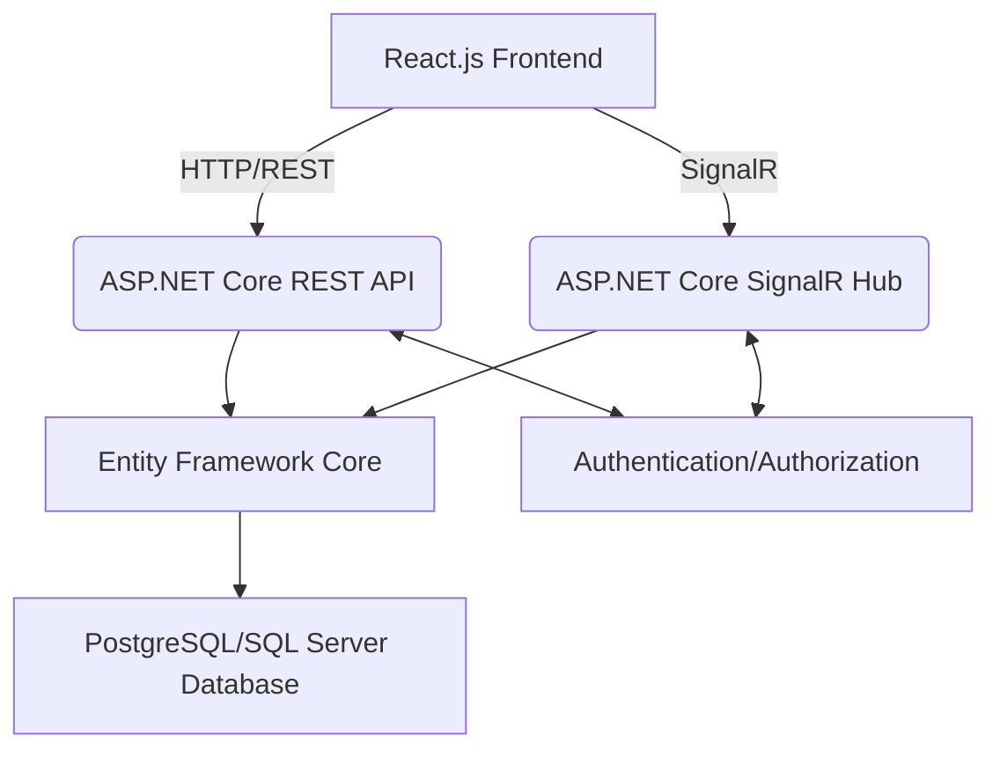

# Architecture – TaskFlow Backend

## System Architecture
The TaskFlow backend employs a hybrid .NET architecture designed for both traditional stateless operations and real-time communication.

## Source Code Paths
- **Controllers (REST API):** Will reside in `Controllers/` directory.
- **Hubs (SignalR):** Will reside in `Hubs/` directory.
- **Services (Business Logic):** Will reside in `Services/` directory.
- **Data Models (EF Core):** Will reside in `Models/` or `Data/Models/` directory.
- **Data Context (EF Core):** Will reside in `Data/` directory.
- **DTOs (Data Transfer Objects):** Will reside in `DTOs/` directory.

## Key Technical Decisions
- **Hybrid Communication:** Utilizing both REST API for initial data fetching and stateless operations, and SignalR for real-time, bidirectional communication to ensure instant UI updates.
- **Clean Architecture Principles:** Separation of concerns with business logic in services, data access via Entity Framework Core, and DTOs for clear data contracts.
- **Strongly Typed Hubs:** To ensure type safety and better developer experience for SignalR communication.
- **Database Choice:** Flexibility to use either PostgreSQL or SQL Server, managed by Entity Framework Core.

## Design Patterns in Use
- **Repository Pattern:** For abstracting data access logic.
- **Service Layer:** To encapsulate business logic and orchestrate operations.
- **Dependency Injection:** For managing component dependencies and promoting testability.

## Component Relationships
- **REST API:** Handles user authentication, initial data loads (e.g., fetching all boards for a user), and creation/deletion of top-level entities.
- **SignalR Hub:** Manages real-time updates for collaborative actions (e.g., moving cards, adding comments, assigning users). It broadcasts changes to relevant clients after data persistence.
- **Entity Framework Core:** ORM for interacting with the database, mapping C# objects to database tables.
- **Database:** Stores all persistent application data (Workspaces, Boards, Lists, Cards, Users, Comments).

## Critical Implementation Paths
- **User Authentication Flow:** Securely authenticating users and authorizing their access to specific workspaces and boards.
- **Real-time Card Movement:** Ensuring seamless drag-and-drop functionality on the frontend with immediate synchronization across all connected clients via SignalR.
- **Data Consistency:** Implementing robust mechanisms to ensure data integrity and consistency, especially during concurrent modifications.

## Core Domain Model
- **Workspace:** The top-level container for multiple project boards.
- **Board:** A single project (e.g., "Website Relaunch"). Contains multiple Lists.
- **List:** A column representing a workflow stage (e.g., "To Do," "In Progress," "Done"). Contains multiple Cards.
- **Card:** A single task that can be moved between lists. Can have comments and user assignments.